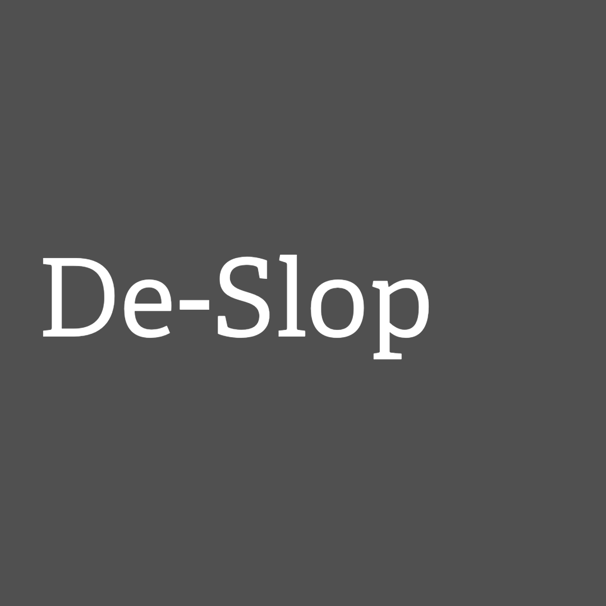
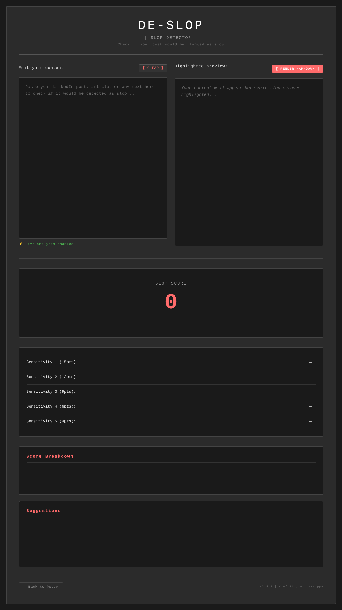
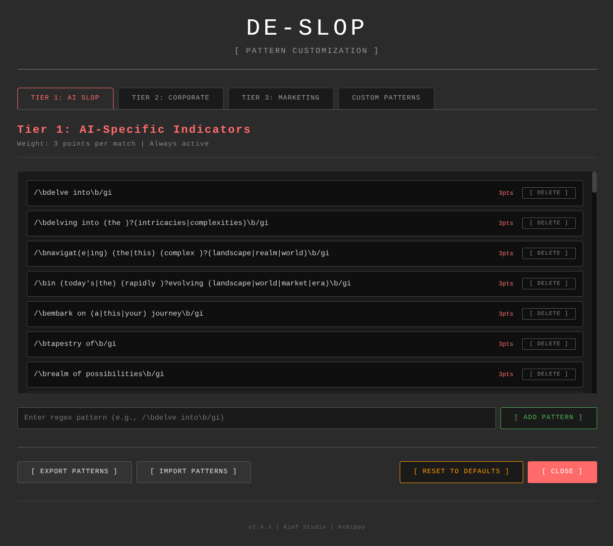

# De-Slop




A Chrome extension that automatically detects and removes AI-generated "slop" content from web pages.

## Features

### Core Detection
- **Three-tier detection system** with weighted pattern matching (600+ patterns)
- **Real-time scanning** of dynamically loaded content
- **Badge counter** showing blocked slop on current page
- **Configurable sensitivity** (1-5 slider)
- **Detection Only Mode** - highlight slop instead of removing it, with hover tooltips
- **Custom pattern editor** - add your own slop patterns with custom weights

### Tools
- **Interactive Slop Checker** - paste text and see what gets flagged
  - Markdown rendering support
  - Real-time highlighting
  - Match explanations
- **Slop Machine** - gamified learning tool
  - Slot machine interface for discovering better word choices
  - Full searchable index of 90+ slop terms and alternatives
  - Track your progress

### LinkedIn Fixer
When on LinkedIn.com, additional features activate:
- **Block auto-play videos**
- **Block ad tracking**
- **Darker mode** - true black LinkedIn theme

### Advanced Features
- **Emoji slop detection** - 166 patterns to flag emoji spam and engagement bait
  - Emoji + buzzword combinations (🚀 Launching, 💡 Innovating)
  - Specific cringe patterns (👇 link below, 🔥 hot take)
  - Emoji chains, walls, and formatting abuse
  - Call-to-action spam (Click 👉, Share 📣)
- **Stop-word filtering** - detect "I'm excited to announce" style posts
- **Em dash detector** - AI loves em dashes
- **Export/import** custom pattern sets


## Installation

### From Chrome Web Store
*Coming soon*

### Development Mode
1. Clone this repository
2. Open Chrome and go to `chrome://extensions/`
3. Enable "Developer mode" (top-right)
4. Click "Load unpacked"
5. Select the `src` directory

## Detection System

De-Slop uses a **three-tier aggression system**:

### Tier 1: AI-Specific Indicators (3 points each)
Signature AI phrases and patterns:
- "delve into", "navigate the landscape", "tapestry of", "realm of possibilities"
- Em dash overuse, excessive transitions
- "In today's fast-paced world...", "As we continue to evolve..."
- Stop words: "I'm excited to announce", "Thrilled to share"
- Listicle patterns: "Top 10 ways to...", "Ultimate guide to..."

**Active at all sensitivity levels**

### Tier 2: Corporate Buzzwords (2 points each)
LinkedIn's greatest hits:
- "synergy", "leverage", "circle back", "low-hanging fruit"
- "take this offline", "touch base", "thought leadership"
- "AI-powered", "blockchain-enabled", "digital transformation"

**Active at sensitivity 3+**

### Tier 3: Marketing Spam (1 point each)
The widest net:
- "free", "guaranteed", "limited time offer", "buy now"
- "amazing", "incredible", "revolutionary", "mind-blowing"
- "basically", "essentially", "actually"

**Active at sensitivity 4+**

### Scoring Thresholds

| Sensitivity | Threshold | Description |
|-------------|-----------|-------------|
| 1 | 15 points | Very conservative - obvious AI only |
| 2 | 12 points | Conservative |
| 3 | 9 points | **Balanced (default)** - AI + corporate |
| 4 | 6 points | Aggressive - includes marketing |
| 5 | 4 points | Nuclear - maximum detection |

## Usage

### Basic Controls
1. Click the extension icon
2. Toggle on/off
3. Adjust sensitivity slider
4. View blocked slop count

### Interactive Checker
1. Click `[ IS MY POST SLOP? ]`
2. Paste your text
3. See highlighted matches with explanations
4. Toggle markdown rendering if needed



### Slop Machine
1. Click `[ SLOP MACHINE ]`
2. Spin for random slop/better alternatives
3. Or browse the full searchable index
4. Filter by category (AI, Corporate, Marketing, Stop Words)


### Pattern Customization
1. Click `[ CUSTOMIZE PATTERNS ]`
2. Add/delete patterns in any tier
3. Create custom patterns with custom weights
4. Export/import pattern sets
5. Changes save automatically



### LinkedIn Fixer
When on LinkedIn, additional toggles appear:
- Block auto-play videos
- Block ad tracking
- Enable darker mode (true black theme)

## How It Works

1. Scans page content using platform-specific selectors
2. Assigns weighted "slop score" based on pattern matches
3. Removes elements exceeding threshold
4. Updates badge counter
5. Monitors for dynamic content (infinite scroll, AJAX)

### Platform Support
- **LinkedIn**: `.feed-shared-update-v2` (individual posts)
- **Twitter/X**: `[data-testid="tweet"]`
- **Medium**: `article`, `.postArticle`
- **All sites**: Generic article/post/card selectors

## Repository Structure

```
DeSlop/
├── src/                  # Extension source code
│   ├── manifest.json     # Extension configuration
│   ├── background.js     # Service worker for badge updates
│   ├── content.js        # Main detection logic (600+ patterns)
│   ├── content.css       # Styles for hiding/highlighting detected slop
│   ├── popup.*           # Main sidebar interface
│   ├── checker.*         # Interactive slop checker
│   ├── slop-machine.*    # Learning slot machine
│   ├── settings.*        # Pattern customization UI
│   ├── linkedin-fixer.js # Video blocking & darker mode
│   ├── rules.json        # Ad blocking rules
│   └── icons/            # Extension icons
├── assets/               # Screenshots and marketing images
├── De-Slop.png          # Logo
├── privacy.html         # Privacy policy
├── LICENSE              # GPL-3.0 license
└── README.md            # This file
```

## Privacy

De-Slop:
- ✓ Runs entirely locally - no data sent to servers
- ✓ Stores settings in Chrome sync storage
- ✓ No analytics or tracking
- ✓ No external API calls
- ✓ Open source - inspect the code

## Permissions

- `storage` - Save your settings
- `activeTab` - Access current page content
- `declarativeNetRequest` - Block LinkedIn ads (optional)
- `<all_urls>` - Scan any page for slop

## Known Limitations

- Pattern-based detection may have false positives
- Very short content (<100 chars) skipped to reduce false positives
- Platform selectors may need updates when sites change
- If your entire LinkedIn feed disappears - it's all slop! Lower sensitivity.

## Version History

**v2.4.4** - Detection Only Mode & Emoji Expansion
- **NEW: Detection Only Mode** - Highlight slop instead of removing it
  - Hover tooltips show which patterns triggered detection
  - Visual feedback with red borders and pulsing animation
- **Massively expanded emoji detection** - From 21 to 166 patterns
  - 80+ emoji + buzzword combinations
  - 35+ specific cringe emoji patterns
  - Emoji formatting abuse detection (chains, walls, bullet points)
  - Call-to-action and hashtag spam detection
- **Simplified UI** - Removed redundant tier toggles
  - Sensitivity slider now directly controls tier activation
  - Collapsible sections for better organization
- **Enhanced checker tool** - Works both in-browser and standalone
  - Improved error handling and fallback support
  - Full pattern sync with live detection engine
- **Pattern coverage expanded** - Now 600+ total detection patterns

**v2.4.3** - Production release
- Fixed pattern customization (Manifest V3 compliance)
- All features stable and tested

**v2.4.2** - Slop Machine
- Added gamified learning tool (slot machine)
- 90+ slop/better pairs with searchable index

**v2.4.1** - Markdown improvements
- Fixed markdown rendering placeholders

**v2.4.0** - Markdown support
- Added markdown toggle to checker

**v2.3.3** - UI improvements
- Fixed checker layout and spacing

**v2.3.1** - Stop words & em dashes
- Added marketing engagement openers
- Em dash instant detection

**v2.2.0** - Interactive checker
- Added slop checker tool
- Real-time text analysis

**v2.1.0** - Emoji detection
- Added emoji slop toggle

**v2.0.0** - LinkedIn Fixer
- Video blocking
- Ad blocking
- Darker mode

**v1.0.0** - Initial release
- Three-tier detection system
- Basic popup controls

## License

GNU General Public License v3.0 (GPL-3.0)

This program is free software: you can redistribute it and/or modify it under the terms of the GNU General Public License as published by the Free Software Foundation, either version 3 of the License, or (at your option) any later version.

This program is distributed in the hope that it will be useful, but WITHOUT ANY WARRANTY; without even the implied warranty of MERCHANTABILITY or FITNESS FOR A PARTICULAR PURPOSE. See the GNU General Public License for more details.

See LICENSE file for full license text.

## Credits

Made by Kief Studio (https://kief.studio)
Developed by HxHippy
