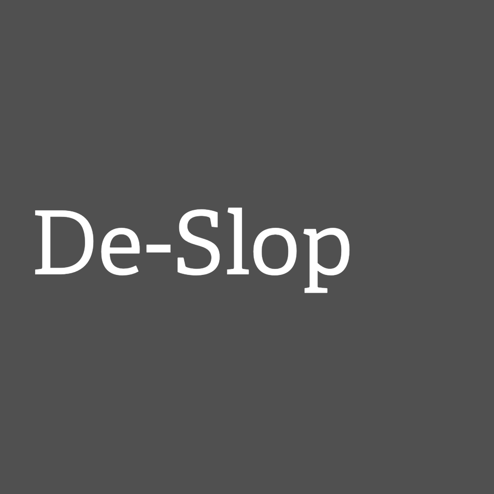
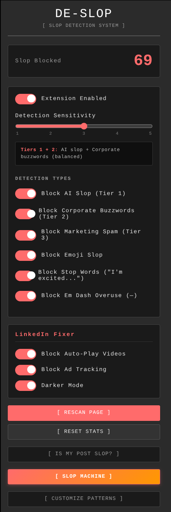
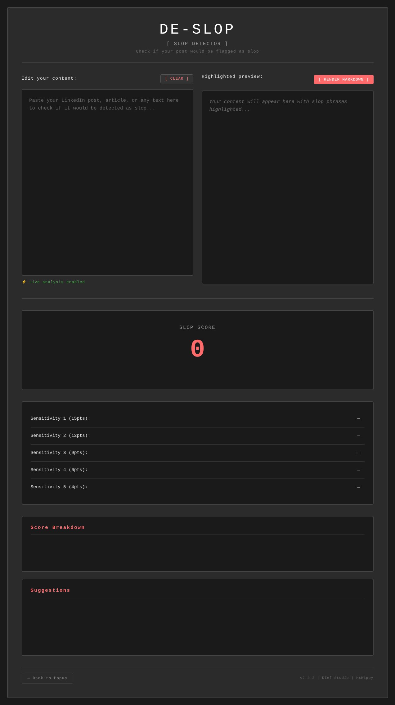
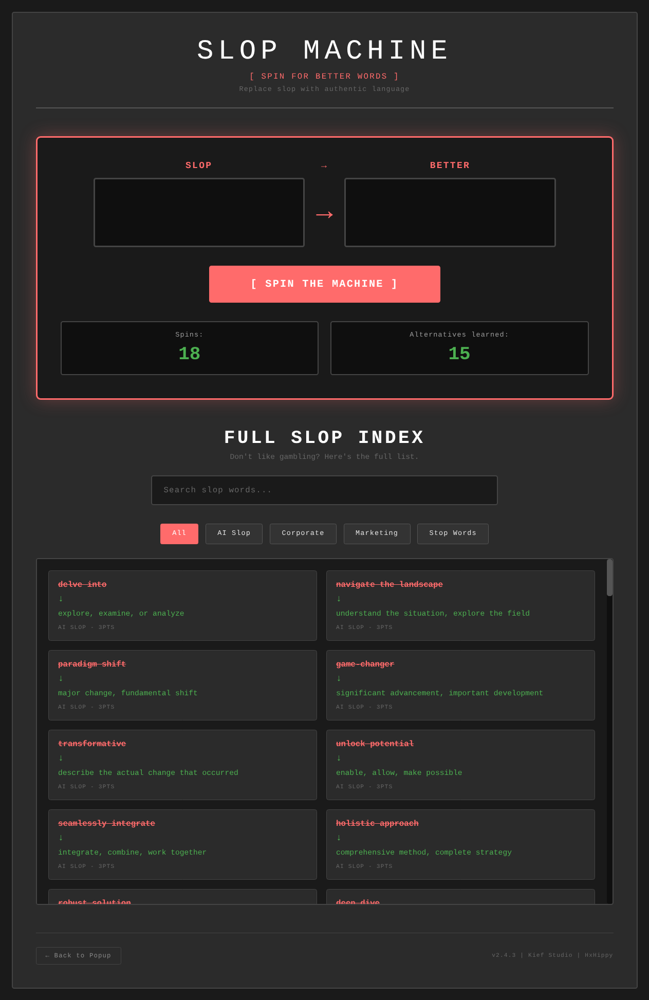
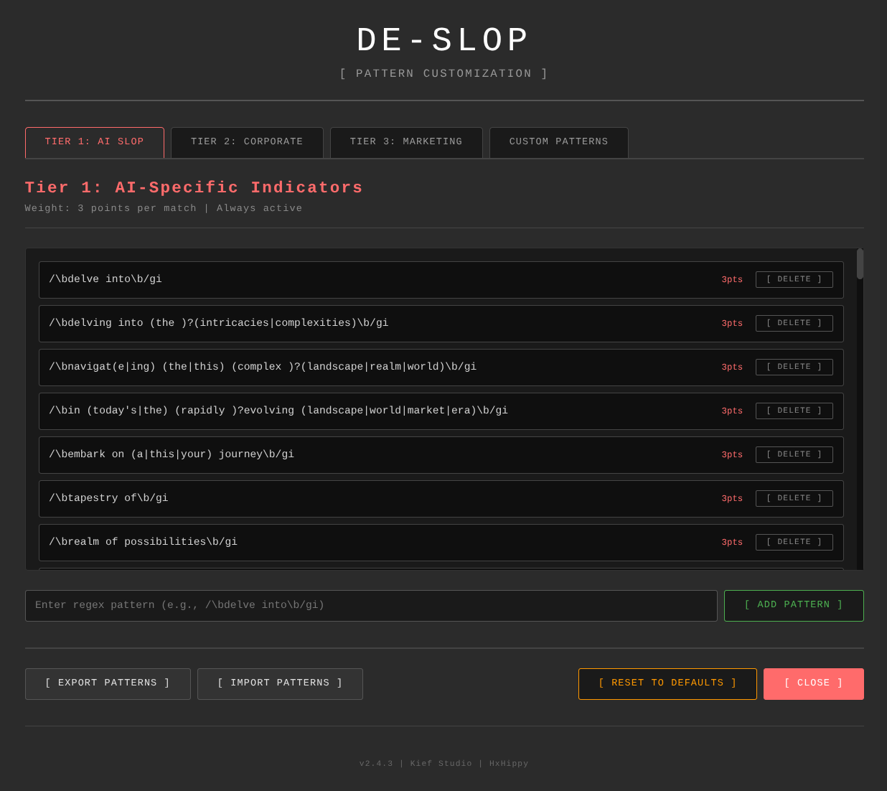

# De-Slop




A Chrome extension that automatically detects and removes AI-generated "slop" content from web pages. Runs entirely locally with no external API calls or data collection.

## Features

### Core Detection
- **Three-tier detection system** with weighted pattern matching (600+ patterns)
- **Multi-language support** - 11 languages: English, Spanish, French, German, Italian, Portuguese, Swedish, Polish, Japanese, Korean, Chinese
- **Real-time scanning** of dynamically loaded content
- **Badge counter** showing blocked slop on current page
- **Configurable sensitivity** (1-5 slider)
- **Detection Only Mode** - highlight slop instead of removing it, with hover tooltips
- **Custom pattern editor** - add your own slop patterns with custom weights
- **Detection-only mode** - highlight slop without removing it

### Analysis Tools
- **Slop Checker** - paste text and see what gets flagged with real-time highlighting and suggestions
- **Humanize Score** - 8-metric writing quality analysis with authenticity scoring
- **Batch Checker** - score multiple text blocks at once with CSV export
- **Text Rewriter** - inline fix suggestions for detected slop phrases
- **Text Comparator** - side-by-side draft comparison with score deltas
- **URL Analyzer** - fetch and score any webpage for slop content
- **Slop Machine** - gamified slot machine for learning better word choices
- **Pattern Tester** - validate detection patterns across all 11 languages

### LinkedIn Fixer
When on LinkedIn.com, additional features activate:
- **Block auto-play videos**
- **Block ad tracking**
- **Darker mode** - true black LinkedIn theme

### Advanced Features
- **Emoji slop detection** - flag emoji spam and engagement bait (166 patterns)
- **Stop-word filtering** - detect "I'm excited to announce" style posts
- **Em dash detector** - AI loves em dashes
- **Political content filter** - optional political content detection
- **YouTube filtering** - video titles, descriptions, Shorts, and clickbait detection
- **Improvement suggestions** - better alternatives for sloppy phrases
- **Export/import** custom pattern sets



## Installation

### From Chrome Web Store
*Coming soon*

### Development Mode
1. Clone this repository
2. Open Chrome and go to `chrome://extensions/`
3. Enable "Developer mode" (top-right)
4. Click "Load unpacked"
5. Select the `src` directory

## Detection System

De-Slop uses a **three-tier aggression system**:

### Tier 1: AI-Specific Indicators (3 points each)
Signature AI phrases and patterns:
- "delve into", "navigate the landscape", "tapestry of", "realm of possibilities"
- Em dash overuse, excessive transitions
- "In today's fast-paced world...", "As we continue to evolve..."
- Stop words: "I'm excited to announce", "Thrilled to share"
- Listicle patterns: "Top 10 ways to...", "Ultimate guide to..."

**Active at all sensitivity levels**

### Tier 2: Corporate Buzzwords (2 points each)
LinkedIn's greatest hits:
- "synergy", "leverage", "circle back", "low-hanging fruit"
- "take this offline", "touch base", "thought leadership"
- "AI-powered", "blockchain-enabled", "digital transformation"

**Active at sensitivity 3+**

### Tier 3: Marketing Spam (1 point each)
The widest net:
- "free", "guaranteed", "limited time offer", "buy now"
- "amazing", "incredible", "revolutionary", "mind-blowing"
- "basically", "essentially", "actually"

**Active at sensitivity 4+**

### Scoring Thresholds

| Sensitivity | Threshold | Description |
|-------------|-----------|-------------|
| 1 | 15 points | Very conservative - obvious AI only |
| 2 | 12 points | Conservative |
| 3 | 9 points | **Balanced (default)** - AI + corporate |
| 4 | 6 points | Aggressive - includes marketing |
| 5 | 4 points | Nuclear - maximum detection |

## Usage

### Basic Controls
1. Click the extension icon
2. Toggle on/off
3. Adjust sensitivity slider
4. View blocked slop count

### Interactive Checker
1. Click `[ IS MY POST SLOP? ]`
2. Paste your text
3. See highlighted matches with explanations
4. Toggle markdown rendering if needed



### Slop Machine
1. Click `[ SLOP MACHINE ]`
2. Spin for random slop/better alternatives
3. Or browse the full searchable index
4. Filter by category (AI, Corporate, Marketing, Stop Words)



### Pattern Customization
1. Click `[ CUSTOMIZE PATTERNS ]`
2. Add/delete patterns in any tier
3. Create custom patterns with custom weights
4. Export/import pattern sets
5. Changes save automatically



### LinkedIn Fixer
When on LinkedIn, additional toggles appear:
- Block auto-play videos
- Block ad tracking
- Enable darker mode (true black theme)

## How It Works

1. Scans page content using platform-specific selectors
2. Assigns weighted "slop score" based on pattern matches
3. Removes elements exceeding threshold
4. Updates badge counter
5. Monitors for dynamic content (infinite scroll, AJAX)

### Platform Support
- **LinkedIn**: `.feed-shared-update-v2` (individual posts)
- **Twitter/X**: `[data-testid="tweet"]`
- **Medium**: `article`, `.postArticle`
- **YouTube**: Videos, Shorts, comments, clickbait detection
- **All sites**: Generic article/post/card selectors

## Repository Structure

```
DeSlop/
├── src/
│   ├── manifest.json        # Extension configuration (Manifest V3)
│   ├── background.js        # Service worker
│   ├── content.js           # Main detection engine
│   ├── content.css          # Styles for hiding/highlighting slop
│   ├── scoring-engine.js    # Shared scoring module
│   ├── i18n-helper.js       # Internationalization helper
│   ├── languages.js         # Language definitions
│   ├── patterns/            # Externalized pattern system
│   │   ├── registry.js      # Pattern registry & language resolution
│   │   ├── en.js            # English patterns (600+)
│   │   ├── es.js, fr.js ... # 10 additional languages
│   ├── _locales/            # Chrome i18n message files (11 locales)
│   ├── popup.*              # Main sidebar interface
│   ├── checker.*            # Interactive slop checker
│   ├── humanize.*           # Writing quality analyzer
│   ├── batch.*              # Batch text analysis
│   ├── rewriter.*           # Inline fix suggestions
│   ├── compare.*            # Side-by-side comparison
│   ├── url-analyzer.*       # URL content scoring
│   ├── slop-machine.*       # Gamified learning tool
│   ├── test.*               # Multi-language pattern tester
│   ├── settings.*           # Pattern customization UI
│   ├── linkedin-fixer.js    # LinkedIn-specific enhancements
│   ├── rules.json           # Ad blocking rules
│   └── icons/               # Extension icons
├── assets/                  # Screenshots and marketing images
├── privacy.html             # Privacy policy
├── LICENSE                  # GPL-3.0 license
└── README.md
```

## Privacy

De-Slop:
- ✓ Runs entirely locally - no data sent to servers
- ✓ Stores settings in Chrome sync storage
- ✓ No analytics or tracking
- ✓ No external API calls
- ✓ Open source - inspect the code

## Permissions

- `storage` - Save your settings
- `activeTab` - Access current page content
- `scripting` - Dynamic language pattern injection
- `sidePanel` - Sidebar interface
- `declarativeNetRequest` - Block LinkedIn ads (optional)
- `<all_urls>` - Scan any page for slop

## Known Limitations

- Pattern-based detection may have false positives
- Very short content (<100 chars) skipped to reduce false positives
- Platform selectors may need updates when sites change
- If your entire LinkedIn feed disappears - it's all slop! Lower sensitivity.

## Version History

**v3.0.0** - Multi-language & Tools Suite
- 11-language pattern system (en, es, fr, de, it, pt, sv, pl, ja, ko, zh)
- Full i18n with localized UI
- 6 new analysis tools (humanize, batch, rewriter, compare, url-analyzer, pattern tester)
- Externalized pattern architecture with shared scoring engine
- Expanded settings with pattern management overhaul

**v2.7.2** - Political Content Filter & YouTube
- Political content filter
- YouTube video/Shorts/comment filtering
- Clickbait pattern detection
- Improvement suggestions

**v2.4.4** - Detection Only Mode
- Highlight-only mode (non-destructive detection)
- Emoji detection expanded to 166 patterns
- Simplified UI with sensitivity-driven tier control

**v2.0.0** - LinkedIn Fixer & Dark Theme
- Complete UI redesign with dark theme
- Pattern customization system with import/export
- LinkedIn video blocking, ad blocking, darker mode

**v1.0.0** - Initial release
- Three-tier detection system
- Basic popup controls

## License

GNU General Public License v3.0 (GPL-3.0)

This program is free software: you can redistribute it and/or modify it under the terms of the GNU General Public License as published by the Free Software Foundation, either version 3 of the License, or (at your option) any later version.

This program is distributed in the hope that it will be useful, but WITHOUT ANY WARRANTY; without even the implied warranty of MERCHANTABILITY or FITNESS FOR A PARTICULAR PURPOSE. See the GNU General Public License for more details.

See LICENSE file for full license text.

## Credits

Made by Kief Studio (https://kief.studio)
Developed by HxHippy
